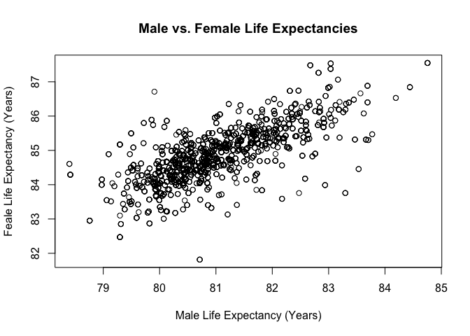

<!-- README.md is generated from README.Rmd. Please edit that file -->

# HealthIneq

<!-- badges: start -->


<!-- badges: end -->

The goal of HealthIneq is to .shed light on the health inequities across
the United States.

## Installation

You can install the development version from
[GitHub](https://github.com/) with:

``` r
# install.packages("devtools")
devtools::install_github("elachtara/HealthIneq")
```

## Example

First you will load the package and call for the data.

``` r
library(HealthIneq)
library(dplyr)
#> 
#> Attaching package: 'dplyr'
#> The following objects are masked from 'package:stats':
#> 
#>     filter, lag
#> The following objects are masked from 'package:base':
#> 
#>     intersect, setdiff, setequal, union
data("HealthIneq")
```

Let’s look at the life expectancy for males vs. females:

``` r
# Create average life expectancy across all counties
HealthIneq  %>% 
  summarize(male_avg = mean(avglifeM), 
            female_avg = mean(avglifeF))
#> # A tibble: 1 x 2
#>   male_avg female_avg
#>      <dbl>      <dbl>
#> 1     81.0       84.9
```

Sorry fellas! Looks like females live on average over 3 years longer
than males.

Let’s make a plot of these life expectancies.

``` r
plot(HealthIneq$avglifeM, HealthIneq$avglifeF, main = "Male vs. Female Life Expectancies",
     xlab = "Male Life Expectancy (Years)", ylab = "Feale Life Expectancy (Years)")
```

 Pretty neat,
appears to be a linear relationship between male and female life
expectancies across the counties of the United States. Check out the
vingette for more examples on how to use the package.
